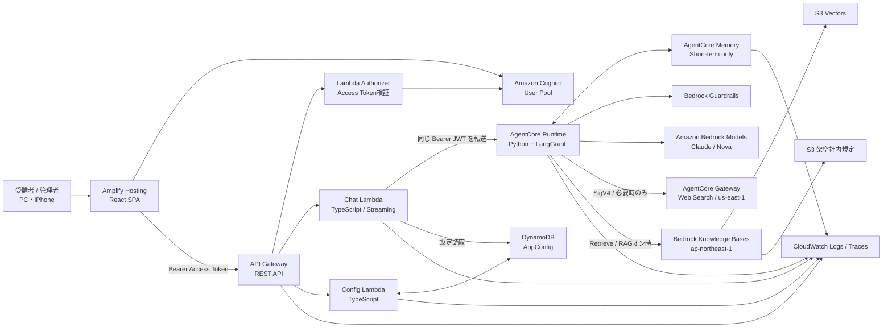
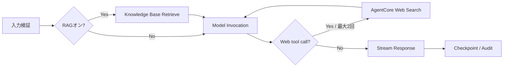
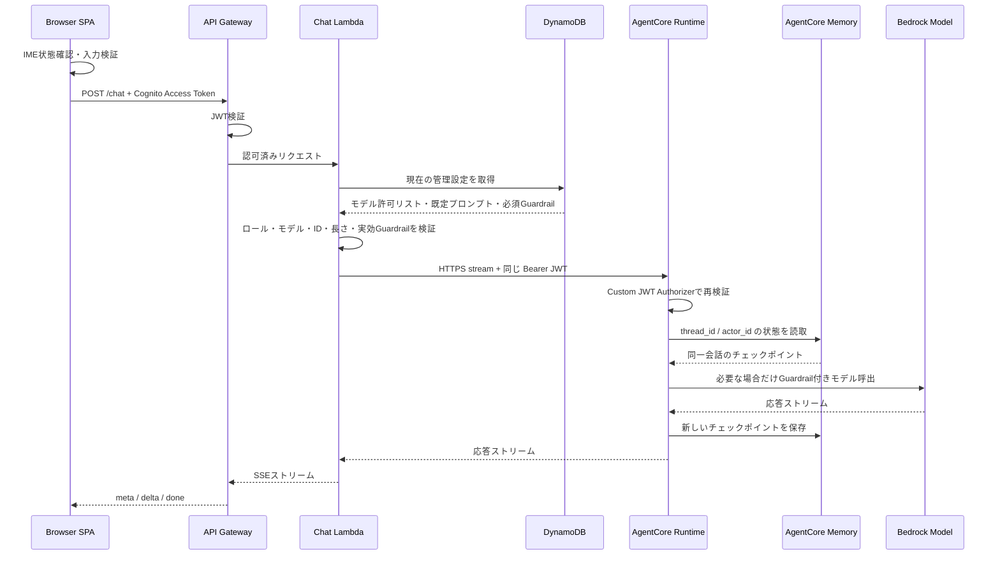
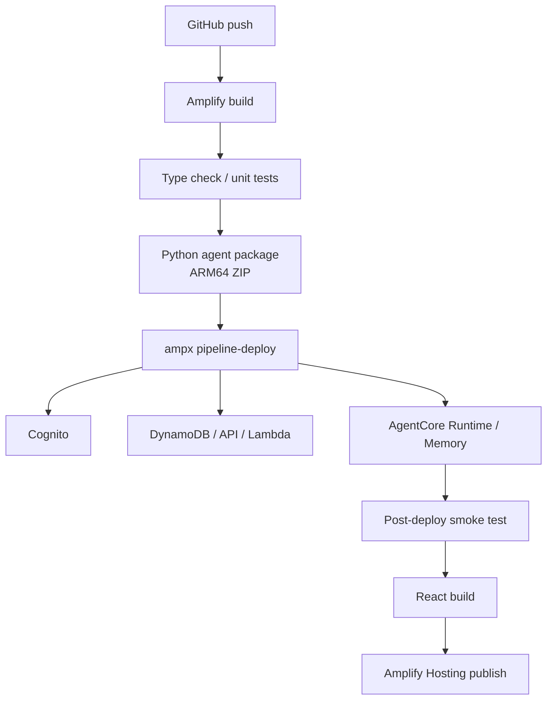

# Generative AI Chat システム設計書

## 1. 設計概要

本システムは、Amplify Hosting 上の React SPA、Cognito User Pool、API Gateway REST API、TypeScript Lambda、DynamoDB、Amazon Bedrock AgentCore Runtime/Memory/Gateway、Bedrock Knowledge Bases、S3 Vectors、Amazon Bedrock 基盤モデルで構成する。

アプリケーションとインフラは TypeScript で統一し、AI Agent のみ Python 3.12 と LangGraph で実装する。Agent は AgentCore Runtime の Direct Code Deployment を使用して ZIP アーカイブとして配備する。

### 1.1 主要設計判断

| 項目 | 採用方式 | 理由 |
|---|---|---|
| API | API Gateway REST API | Lambda Authorizer、レスポンスストリーミング、アクセスログを利用するため |
| チャット応答 | SSE ストリーミング | 早い初期表示と長いモデル応答に対応するため |
| Lambda | TypeScript / Node.js 22 | Lambda のネイティブ応答ストリーミングとアプリ全体の型共有を利用するため |
| Agent | Python 3.12 / LangGraph | AgentCore Python SDK と `AgentCoreMemorySaver` の公式統合を利用するため |
| Agent 配備 | Direct Code Deployment | コンテナ不要で更新が速く、トレーニング用の小規模 Agent に適するため |
| メモリ | AgentCore Memory の短期メモリのみ | セッション内の会話継続と、セッション間の分離を両立するため |
| 認証 | Cognito Access Token + Lambda Authorizer | 独自ログイン画面のSRP認証を維持し、API GatewayとAgentCore Runtimeで同じ利用者トークンを検証するため |
| 管理設定 | DynamoDB 単一設定レコード | 小規模で高可用、管理不要、条件付き更新が可能なため |
| Web検索 | AgentCore Gateway + Web Search connector | APIキー不要のフルマネージドMCPツールで、検索元情報を保持できるため |
| RAG | Bedrock Knowledge Bases + S3 Vectors | OpenSearchを常時稼働させず、少量・低頻度の教材検索をサーバーレスで実現するため |
| IaC | Amplify Gen 2 + CDK TypeScript | フロントとカスタム AWS リソースを一つのデプロイに統合するため |

## 2. 全体アーキテクチャ



### 2.1 信頼境界

1. ブラウザは信頼しない。モデル ID、ロール、セッション ID、プロンプト長をサーバー側で再検証する。
2. API Gateway の Lambda Authorizer は Cognito Access Token の署名、発行元、App Client ID、有効期限、`token_use=access` を検証する。
3. Lambda Authorizer は検証済みの `sub` と `cognito:groups` だけを authorizer context に渡し、業務 Lambda はその値でアプリケーションロールを検証する。
4. Chat Lambda は受信した JWT を AgentCore Runtime の HTTPS エンドポイントへそのまま Bearer Token として転送する。
5. AgentCore Runtime は Cognito OIDC discovery URL と App Client ID を使い、同じ JWT を再検証する。
6. AgentCore Runtime の実行ロールだけが Bedrockモデル、Guardrail、Memory、Knowledge Base、Web Search Gatewayにアクセスできる。

## 3. コンポーネント設計

### 3.1 React SPA

| 項目 | 設計 |
|---|---|
| フレームワーク | React + TypeScript + Vite |
| 認証クライアント | AWS Amplify Auth |
| 状態管理 | React Context または軽量ストア。永続化対象を明示的に分離する |
| API クライアント | `fetch`。チャットは SSE ストリームを直接処理する |
| バリデーション | Zod などで API 応答と設定をランタイム検証する |
| スタイル | CSS Modules または単一デザイントークン層。モバイルファーストのレスポンシブ設計 |

ブラウザ保存先は次のように限定する。

| データ | 保存先 | 有効期間 |
|---|---|---|
| Cognito 認証セッション | Amplify Auth の標準保存領域 | ログアウトまたはトークン期限まで |
| `browserSessionId` | `sessionStorage` | タブを閉じるまで |
| `conversationSessionId` | `sessionStorage` | クリアまたはタブを閉じるまで |
| 利用者プロンプト | `sessionStorage` | ログアウトまたはタブを閉じるまで |
| 受講者 Guardrail | `sessionStorage` | ログアウトまたはタブを閉じるまで |
| 受講者ツール選択 | `sessionStorage` | ログアウトまたはタブを閉じるまで |
| 画面上の会話 | React メモリ | リロード、クリア、ログアウトまで |
| 管理者設定 | 永続保存しない。API から再取得 | 画面表示中のみ |

利用者設定はデータベースへの保存禁止をセキュリティ境界とはしない。重要なのは、共有 Cognito ユーザーだけをキーにせず、アプリが発行・検証する `browserSessionId` を分離キーへ必ず含めることである。現行実装は再読み込みや Runtime の再作成にも強い `sessionStorage` を正本とし、利用者プロンプト、推論設定、受講者 Guardrail、ツール選択を各チャット要求で渡す。将来 AgentCore Runtime または AgentCore Memory に保持する場合も、この分離キー設計を維持する。

### 3.2 Cognito

- User Pool の自己サインアップを無効化する。
- App Client にクライアントシークレットを設定しない。SPA に秘密情報を配置しない。
- SPA はクライアントシークレットを持たず、ユーザー名・パスワードによる Cognito SRP 認証を行う。共有ログインIDにはメールアドレス形式のユーザー名を使用できる。
- 一般受講者用グループ `Students`、管理者用グループ `Admins` を作成する。
- 一般受講者用共有ユーザーを `Students` に所属させる。
- 管理者ユーザーを `Admins` に所属させる。
- パスワードポリシーと一時パスワード変更方法は講師向け運用手順に記載する。
- トレーニング環境では MFA を必須にしないが、管理者だけ MFA を有効化できる構成を許容する。
- Access Token を API 認可に使用する。ID Token を API の Bearer Token として使用しない。

### 3.3 API Gateway

REST API を採用し、すべての業務ルートに Cognito Access Token を検証する Token 型 Lambda Authorizer を設定する。

| メソッド | パス | 応答 | ロール |
|---|---|---|---|
| `GET` | `/config` | JSON | Students / Admins |
| `POST` | `/chat` | SSE stream | Students / Admins |
| `GET` | `/admin/config` | JSON | Admins |
| `PUT` | `/admin/config` | JSON | Admins |
| `GET` | `/health` | JSON | 認証不要または運用限定 |

設計条件:

- `/chat` は Lambda proxy integration の response transfer mode を `STREAM` にする。
- その他のルートは `BUFFERED` とする。
- CORS は明示的な `ALLOWED_ORIGINS`、Amplify Hosting ドメイン、ローカル開発オリジンだけを反映し、`Access-Control-Allow-Origin: *` を使用しない。
- Authorization ヘッダーだけを認証に使用する。
- REST API のアクセスログに Authorization ヘッダーや本文を含めない。
- 本文は各 Lambda/Agent の構造化監査ログに記録する。
- API レベル、メソッドレベル、Lambda reserved concurrency の三層で同時利用を制御する。

### 3.4 Chat Lambda

TypeScript / Node.js 22 で実装し、次を担当する。

1. API Gateway の Lambda authorizer context を検証する。
2. リクエスト本文をスキーマ検証する。
3. DynamoDB から現在の管理設定、必須 Guardrail、ツールのデフォルト設定を取得する。
4. 選択モデルが有効モデルに含まれることを検証する。
5. 管理者必須 Guardrail と受講者 Guardrail から実効 Guardrail を解決する。
6. 検証済みの受講者ツール指定を適用し、`actorId` を導出する。
7. Cognito JWT を AgentCore Runtime に転送する。
8. AgentCore の応答ストリームを SSE に正規化してブラウザへ転送する。
9. リクエスト結果、レイテンシー、実効 Guardrail を構造化ログに記録する。

Lambda は `awslambda.streamifyResponse` を使用する。AgentCore Runtime への接続には JWT 認証付き HTTPS を使う。OAuth/JWT 経路では AgentCore の AWS SDK invocation ではなく Runtime HTTPS エンドポイントを利用する。

### 3.5 Config Lambda

TypeScript で実装する。読み取りと管理更新は関数またはハンドラーを分け、最小権限を付与する。

- 一般設定取得: クライアントに必要な表示名、モデルキー、既定モデル、必須 Guardrail、ツールのデフォルト設定だけを返す。管理者プロンプト本文や Guardrail ID は返さない。
- 管理設定取得・更新: `Admins` グループを必須とし、完全な設定を扱う。
- 更新は DynamoDB の `configVersion` 条件式を使う。
- 更新成功後に `configVersion` を 1 増加させる。
- 更新者は Cognito の `sub` を記録する。アクセストークン自体は保存しない。

### 3.6 DynamoDB

テーブル名はデプロイ時に生成し、アプリコードには環境変数で渡す。

| 項目 | 値 |
|---|---|
| パーティションキー | `pk` (String) |
| 課金モード | On-demand |
| 暗号化 | AWS managed key。必要に応じて customer managed KMS key に変更 |
| PITR | トレーニング環境では無効 |
| 削除ポリシー | Destroy |

設定レコード例:

```json
{
  "pk": "APP_CONFIG",
  "configVersion": 1,
  "defaultModelKey": "claude-sonnet-5",
  "enabledModelKeys": [
    "claude-sonnet-5",
    "nova-2-lite",
    "nova-micro",
    "nova-pro"
  ],
  "defaultSystemPrompt": "",
  "requiredGuardrailKeys": [],
  "defaultToolKeys": [],
  "usdToJpyRate": 150,
  "updatedAt": "2026-08-16T00:00:00Z",
  "updatedBy": "cognito-sub"
}
```

モデルと Guardrail の実 ID、表示名、IAM 対象 ARN はコード側の固定カタログで管理する。DynamoDB には安全な論理キーのみ保存する。

### 3.7 AgentCore Runtime

| 項目 | 設計 |
|---|---|
| 言語 | Python 3.12 |
| フレームワーク | LangGraph |
| プロトコル | HTTP、SSE 応答 |
| 配備 | ZIP Direct Code Deployment |
| エントリーポイント | `agent/main.py` |
| 認証 | Custom JWT Authorizer |
| セッション | `runtimeSessionId = SHA-256(actorId + ':' + conversationSessionId)` |
| ネットワーク | 初期は PUBLIC。外部公開は AgentCore authorizer で保護する |
| 実行ロール | Bedrock、Guardrails、AgentCore Memory、Knowledge Base、Web Search Gateway、CloudWatch の必要最小限 |

CloudFormation の次のリソース型を CDK の L1 または `CfnResource` から使用する。これらは 2026-08-16 時点で `ap-northeast-1` の CloudFormation Registry に存在することを確認済みである。

- `AWS::BedrockAgentCore::Runtime`
- `AWS::BedrockAgentCore::RuntimeEndpoint`
- `AWS::BedrockAgentCore::Memory`

Runtime 設定:

- Cognito OIDC discovery URL を `AuthorizerConfiguration` に設定する。
- Cognito App Client ID を allowed client として設定する。
- Authorization ヘッダーを request header allowlist に含める。
- Runtime endpoint が `READY` になるまでデプロイ後テストを待機する。
- Runtime endpoint はバージョン指定または `DEFAULT` qualifier を利用する。

### 3.8 LangGraph Agent

Agentは通常チャットを基本とし、受講者がWeb検索を明示的にオンにした場合だけReAct型のツールループを有効にする。RAGはツール選択とは別に、オンの場合はモデル呼び出し前に決定的に1回検索する。LangGraphでモデル、ツール、短期メモリを一つのグラフとして管理する。



推奨パッケージ:

- `langgraph`
- `langchain-aws`
- `langgraph-checkpoint-aws`
- `bedrock-agentcore`
- `pydantic`
- AWS Distro for OpenTelemetry の AgentCore 対応パッケージ

#### Web検索

Web Search connectorは提供リージョンである`us-east-1`にAgentCore Gatewayとして作成する。東京のAgentCore Runtimeは実行ロールの一時認証情報を用い、MCP Streamable HTTP要求をサービス名`bedrock-agentcore`、リージョン`us-east-1`でSigV4署名する。APIキー、固定クレデンシャル、受講者JWTはGatewayへ渡さない。

受講者の初期選択はオフとする。オンの場合もモデルが最新情報を必要と判断したときだけ`web_search`を呼び出す。1回答の上限は2検索、1検索の結果上限は5件とする。connectorが返すタイトル、URL、抜粋、公開日を保持し、回答本文とは別の参照元欄に表示する。

#### RAG

東京リージョンにS3データソース、Bedrock Knowledge Base、Titan Text Embeddings V2（1,024次元）、S3 Vectorsを作成する。OpenSearch ServiceとOpenSearch Serverlessは使用しない。文書は公開リポジトリ内の架空企業「蒼空フロンティア株式会社」の日本語社内規定だけを対象とする。

受講者がRAGをオンにした各メッセージで`Retrieve`を1回呼び出し、上位4チャンクをモデルの一時参考情報へ追加する。取得チャンクは命令ではなくデータとして扱い、チャンク中の命令文を実行しない旨をモデルへ伝える。取得した文書名と抜粋は信頼済み参照元として表示し、会話履歴やDynamoDBへ利用者設定として保存しない。

モデル呼び出しには出力上限を明示し、未指定の最大値を利用しない。

### 3.9 AgentCore Memory

- `AgentCoreMemorySaver` を LangGraph checkpointer として使用する。
- `thread_id` には Chat Lambda が導出した `runtimeSessionId` を設定し、Runtime の実行分離単位と Memory の会話単位を一致させる。
- `actor_id` に `SHA-256(cognitoSub + ':' + browserSessionId)` を設定する。
- 長期メモリ用 `AgentCoreMemoryStore` は使用しない。
- Semantic、User Preference、Summarization、Episodic の長期戦略は設定しない。
- Event expiry はサービス許容最小値の 3 日とする。
- クリア時は新しい `conversationSessionId` に切り替え、古いセッションを再利用しない。
- 古い短期メモリの物理削除は非同期の有効期限または環境削除で行う。
- 利用者プロンプトは現行実装では LangGraph の Runtime Context として渡し、チェックポイントの metadata には保存しない。
- 将来利用者設定を Memory に保存する場合も、`actor_id` と `thread_id` の両方でスコープし、Cognito `sub` 単独では読み書きしない。

この方式により、同一の共有 Cognito ユーザーでも `browserSessionId` と `conversationSessionId` が異なる限り、メモリが混在しない。

AgentCore Runtime は `runtimeSessionId` ごとに専用 microVM を割り当てるため、Runtime 内のメモリとファイルシステムもセッション間で分離される。一方、Runtime はセッションと利用者の対応を強制しないため、Chat Lambda は JWT の `sub`、`browserSessionId`、`conversationSessionId` からサーバー側で Runtime セッション ID と `actor_id` を導出し、クライアント指定値をそのまま認可境界に使用しない。Runtime のローカル状態はライフサイクル終了時に消失し得るため、永続性が必要な状態にはブラウザ保存または AgentCore Memory を使用する。

### 3.10 Bedrock モデル

2026-08-17 に対象アカウントの `ap-northeast-1` で AWS API により ACTIVE を確認したモデルを初期カタログとする。

| 論理キー | 表示名 | 推論プロファイル ID | 備考 |
|---|---|---|---|
| `claude-sonnet-5` | Claude Sonnet 5 | `global.anthropic.claude-sonnet-5` | Global cross-region inference |
| `nova-2-lite` | Nova 2 Lite | `jp.amazon.nova-2-lite-v1:0` | Japan geographic cross-region inference profile |
| `nova-micro` | Nova Micro | `apac.amazon.nova-micro-v1:0` | APAC cross-region inference |
| `nova-pro` | Nova Pro | `apac.amazon.nova-pro-v1:0` | APAC cross-region inference |

モデル ARN への IAM 許可では、推論プロファイル ARNと、ルーティング先になり得る foundation model ARN の両方を許可する。モデル追加時はコードカタログ、IAM、テストを更新して再デプロイする。

初期推論設定:

| 項目 | 値 |
|---|---|
| `maxTokens` | 1,024 |
| `temperature` | 0.3 |
| `topP` | 未指定（モデル既定） |
| リトライ | Throttling、ServiceUnavailable、ModelTimeout のみ指数バックオフ |
| タイムアウト | Agent 全体の上限を明示し、クライアント切断後の実行も監視する |

受講者は設定ダイアログから上記3項目を変更できる。設定はブラウザタブの `sessionStorage` に保存し、共有CognitoユーザーやDynamoDBをキーとした全体設定にはしない。SPA、Chat Lambda、Agentの3層で値を検証し、Chat Lambdaの監査ログには実際に使用した値を記録する。Top Pが未指定の場合、Agentは`top_p`をBedrock Converseへ渡さず、モデル既定値を使用する。最大アウトプットトークンは未指定にせず常に明示し、トークンクォータの過剰予約を避ける。

#### トークン数とモデル推論料金

AgentはBedrockのストリーム完了イベントからInput / Outputトークン数を取得する。Chat Lambdaは、信頼済みの論理モデルキー、リクエスト開始日時、コードカタログのUSD単価、DynamoDBのUSD/JPY換算レートを用いて日本円概算を計算し、`done`イベントへ付加する。ブラウザは計算を行わず、AIが生成したMarkdownとは別のメタデータ領域に表示する。

計算式:

```text
Input料金(円)  = Inputトークン数  × Input単価(USD / 1M tokens)  × USD/JPY ÷ 1,000,000
Output料金(円) = Outputトークン数 × Output単価(USD / 1M tokens) × USD/JPY ÷ 1,000,000
合計(円)       = Input料金 + Output料金
```

2026-08-17確認時点の[AWS Bedrock標準オンデマンド単価](https://aws.amazon.com/bedrock/pricing/)。Nova系はAWS Price List APIの東京リージョン価格でも照合する。

| モデル | Input USD / 1M tokens | Output USD / 1M tokens | 適用期間 |
|---|---:|---:|---|
| Claude Sonnet 5 | 2.00 | 10.00 | 2026-08-31までのローンチ料金 |
| Claude Sonnet 5 | 3.00 | 15.00 | 2026-09-01以降 |
| Nova 2 Lite | 0.396 | 3.311 | 現行 |
| Nova Micro | 0.042 | 0.168 | 現行 |
| Nova Pro | 0.96 | 3.84 | 現行 |

[クロスリージョン推論](https://docs.aws.amazon.com/bedrock/latest/userguide/cross-region-inference.html)はリクエスト元リージョンの料金を使用する。表示額は基盤モデルの入出力トークン推論だけを対象とし、AgentCore Runtime / Memory、Guardrails、Lambda、API Gateway、ログ等の料金を含めない。AWS料金改定時はコードカタログと確認日を更新して再デプロイする。既存のDynamoDBレコードに`usdToJpyRate`がない場合は150を読み取り時の初期値とする。

### 3.11 Bedrock Guardrails

受講者と管理者は、次の論理プリセットをチェックボックスでゼロ個以上選択する。初期値は双方とも空配列とし、アプリ標準ではGuardrailを自動適用しない。受講者の選択はブラウザタブの `sessionStorage` に保存されるため、同じCognito IDを使用する別の受講者には波及しない。管理者の必須選択だけはDynamoDBに保存され、全受講者へ共通適用する。

| 論理キー | 表示名 | 主な設定 |
|---|---|---|
| `none` | なし | Guardrailを送信しない |
| `content-safety` | コンテンツ保護 | Hate、Insults、Sexual、Violence、MisconductをMediumで評価 |
| `prompt-attack` | プロンプト攻撃対策 | Prompt AttackをHighで入力評価 |
| `sensitive-information` | 個人情報の匿名化 | EMAIL、PHONEを入力・出力でANONYMIZE |
| `denied-topic-travel` | 禁止トピック: 旅行 | 旅行、観光、宿泊、旅程を拒否 |
| `blocked-word-pineapple` | 禁止ワード: pineapple | Word filters対応言語の英単語を使う完全一致フィルター |

Converse/ConverseStreamの `guardrailConfig` は一つのGuardrail IDしか指定できない。このためCDKは、5ポリシーの空集合を除く全組み合わせ `2^5 - 1 = 31` 個のGuardrailを作成する。Chat Lambdaは管理者選択と受講者選択の和集合をカタログ順に正規化し、対応するIDと番号付きバージョンをAgentへ渡す。選択が空ならGuardrailを渡さない。クライアント指定のIDやバージョンは受け付けない。

日本語評価のためコンテンツフィルター、Prompt Attack、Denied TopicsはStandard tierを使用し、`apac.guardrail.v1:0`でクロスリージョン評価する。Word filtersは日本語に対応しないため、教材語句には対応言語である英語の `pineapple` を使用する。モデル呼び出しには `trace=disabled` と同期ストリーム評価を指定する。`guardContent`による部分評価や単独の`ApplyGuardrail` APIではなく、会話全体を保護する `guardrailConfig` を使用する。

PII匿名化後も、Chat Lambdaの監査ログには受講者の原入力が保存される。教材では架空のメールアドレスと電話番号だけを使用し、ログはKMS暗号化、最小権限、7日保持を維持する。

## 4. セッション設計

### 4.1 ID 一覧

| ID | 生成元 | スコープ | 用途 |
|---|---|---|---|
| Cognito `sub` | Cognito | ユーザー | 認証主体。共有受講者では全員同一 |
| `browserSessionId` | SPA の UUID v4 | ブラウザタブ | 同一共有ユーザー内の受講者分離 |
| `conversationSessionId` | SPA の UUID v4 | クリアまで | 会話の論理ID、Runtime/Memory分離キーの入力 |
| `runtimeSessionId` | Chat Lambda | クリアまで | AgentCore Runtime と Memory の共通会話分離ID |
| `actorId` | Chat Lambda | ブラウザタブ | Memory の actor 分離 |
| `requestId` | SPA または API | 1 メッセージ | 重複防止、ログ相関 |

`runtimeSessionId` は 64 文字の SHA-256 hex 値とし、AgentCore Runtime のセッション ID 長要件を満たす。

### 4.2 チャットシーケンス



### 4.3 クリア

1. 送信中ならストリームをキャンセルする。
2. 画面上のメッセージを削除する。
3. 利用者プロンプト、推論設定、受講者 Guardrail は現在のブラウザセッション設定として維持する。別ブラウザセッションには引き継がない。
4. 新しい `conversationSessionId` を生成する。
5. 古い ID は再利用しない。
6. CloudWatch の監査ログは削除しない。

## 5. プロンプト設計

### 5.1 優先順位

```text
1. 設定されている場合の Bedrock Guardrails（システムプロンプトとは独立して適用）
2. 管理者が編集するアプリ既定プロンプト
3. 受講者が設定する人格・口調プロンプト
4. AgentCore Memory から復元した会話履歴
5. 現在のユーザーメッセージ
```

コード固定のシステムプロンプトは設けない。アプリとして必要な役割、制約、安全上の指示は、管理者が編集する「アプリ既定プロンプト」で指定する。選択された Bedrock Guardrails とモデル組み込みの安全機能は、これとは独立して適用する。

アプリ既定プロンプトの初期値は空文字列とし、管理者は空のまま保存できる。アプリ既定プロンプトと受講者のシステムプロンプトがともに空の場合、Agent は Bedrock へ system メッセージを送信しない。

### 5.2 動的プロンプト変数

アプリ既定プロンプトと「システムプロンプト(ペルソナ)」では次の変数を利用できる。

| 変数 | チャット実行時の値 |
|---|---|
| `$DATETIME` | 利用者タイムゾーンで表した現在日時。ISO 8601形式でUTCオフセットを含む。 |
| `$TIMEZONE` | ブラウザが報告したIANAタイムゾーン名（例: `Asia/Tokyo`）。 |

画面には各変数の挿入ボタンを置き、選択範囲またはカーソル位置へ挿入する。DynamoDBおよびブラウザセッションには未展開のテンプレートを保存する。ブラウザはタイムゾーン名だけを送信し、Chat Lambdaが入力検証後、サーバー時刻を基準に両変数を展開してAgentCore Runtimeへ渡す。これにより、クライアントが現在日時を偽装する経路を設けない。

### 5.3 組み立て例

```text
<admin_system_prompt>
{DynamoDB に保存された管理者プロンプト}
</admin_system_prompt>

<user_persona>
{現在の browser session に分離された利用者プロンプト}
</user_persona>

両方が存在し、指示が競合する場合は admin_system_prompt > user_persona とする。
```

管理者プロンプトと利用者プロンプトは XML 風の明示的な区切りで分離する。空のレイヤーや「追加指示なし」のようなプレースホルダーは追加しない。プロンプトの区切りは指示の優先順位を伝えるための補助であり、Guardrails と入力検証を併用する。

## 6. API 設計

### 6.1 `GET /config`

応答例:

```json
{
  "configVersion": 4,
  "defaultModelKey": "claude-sonnet-5",
  "models": [
    {"key": "claude-sonnet-5", "label": "Claude Sonnet 5"},
    {"key": "nova-2-lite", "label": "Nova 2 Lite"},
    {"key": "nova-micro", "label": "Nova Micro"},
    {"key": "nova-pro", "label": "Nova Pro"}
  ],
  "requiredGuardrailKeys": []
}
```

一般利用者には管理者プロンプト本文、実モデル ID、Guardrail IDとバージョンを返さない。

### 6.2 `POST /chat`

要求:

```json
{
  "requestId": "550e8400-e29b-41d4-a716-446655440000",
  "browserSessionId": "55f4ec01-f06b-4d97-8cf7-19999ddabda0",
  "conversationSessionId": "b52817f8-3778-45be-8ca6-5ad67956b9f7",
  "modelKey": "claude-sonnet-5",
  "message": "生成AIとは何ですか？",
  "userSystemPrompt": "親しみやすい先生として説明してください。現在日時は $DATETIME です。",
  "guardrailKeys": ["denied-topic-travel", "blocked-word-pineapple"],
  "timeZone": "Asia/Tokyo",
  "generationConfig": {
    "temperature": 0.3,
    "topP": null,
    "maxOutputTokens": 1024
  }
}
```

SSE イベント:

```text
event: meta
data: {"requestId":"...","modelKey":"claude-sonnet-5"}

event: delta
data: {"text":"生成AIは"}

event: done
data: {"finishReason":"end_turn","usage":{"inputTokens":120,"outputTokens":85,"estimate":{"modelKey":"claude-sonnet-5","currency":"JPY","inputCostJpy":0.036,"outputCostJpy":0.1275,"totalCostJpy":0.1635,"inputUsdPerMillionTokens":2,"outputUsdPerMillionTokens":10,"usdToJpyRate":150,"priceVerifiedAt":"2026-08-17","scope":"MODEL_INFERENCE_ONLY"}}}
```

エラーは `event: error` で安全なエラーコードだけを返す。HTTP レスポンス開始後はステータスコードを変更できないため、ストリーム内エラーイベントを使用する。

### 6.3 `GET /admin/config`

管理者にだけ、`configVersion`、有効モデル、既定モデル、アプリ既定プロンプト、必須Guardrail論理キー配列、USD/JPY換算レート、更新日時、更新者を返す。Lambda は `cognito:groups` に `Admins` が含まれることを必ず検証する。

### 6.4 `PUT /admin/config`

要求:

```json
{
  "expectedConfigVersion": 4,
  "defaultModelKey": "nova-2-lite",
  "enabledModelKeys": ["claude-sonnet-5", "nova-2-lite"],
  "defaultSystemPrompt": "",
  "requiredGuardrailKeys": ["content-safety", "prompt-attack"],
  "usdToJpyRate": 150
}
```

競合時は `409 CONFIG_VERSION_CONFLICT` を返し、クライアントに再取得を促す。

### 6.5 エラーコード

| コード | HTTP/イベント | 意味 |
|---|---|---|
| `UNAUTHORIZED` | 401 | JWT がない、無効、期限切れ |
| `FORBIDDEN` | 403 | ロール不足 |
| `VALIDATION_ERROR` | 400 | 入力形式、長さ、ID が不正 |
| `MODEL_NOT_ALLOWED` | 400 | モデルが管理設定で無効 |
| `CONFIG_VERSION_CONFLICT` | 409 | 管理設定の更新競合 |
| `RATE_LIMITED` | 429 / SSE | 利用上限超過 |
| `MODEL_TIMEOUT` | 504 / SSE | モデル応答時間超過 |
| `AGENT_UNAVAILABLE` | 503 / SSE | AgentCore または Bedrock の一時障害 |
| `INTERNAL_ERROR` | 500 / SSE | 予期しない内部エラー |

## 7. UI 設計

### 7.1 画面構成

#### ログイン画面

- `Generative AI Chat`
- ユーザー名
- パスワード
- ログインボタン

#### チャット画面

- ヘッダー: タイトル、モデル選択、設定、管理設定（管理者のみ）、ログアウト。アイコンはホバーまたはフォーカス時に操作名を表示する
- メッセージ領域: 利用者と AI の発言
- 応答待ち表示: `AI Thinking...`。最初のSSE `delta`受信時に消去し、以降は応答を逐次表示する
- AI応答表示: GitHub Flavored Markdown。生HTMLは解釈せず、外部リンクは別タブで安全に開く
- 思考表示: モデルが`<thinking>...</thinking>`を本文へ出力した場合は、通常回答から分離して初期状態で閉じた`AI Thinking`領域にMarkdown表示する。ストリーミング途中で閉じタグが未到着でもタグ自体は表示しない
- 利用量・料金表示: AI応答ごとに初期状態で閉じた領域を置き、Input / Outputトークン数、各料金、合計、単価、USD/JPY換算レート、料金確認日を表示する。基盤モデル推論だけの概算である旨を併記する
- 参照元表示: Web検索またはRAGを使用した回答では、初期状態で閉じた領域に検索元タイトル、リンクまたは文書名、抜粋を表示する
- 入力領域: 自動拡張 textarea、送信ボタン、クリアボタン

#### 利用者設定ダイアログ

- システムプロンプト(ペルソナ)
- `$DATETIME` / `$TIMEZONE` 挿入ボタン
- Temperature（初期値0.3）
- Top P（初期状態はモデル既定）
- 最大アウトプットトークン（初期値1,024）
- Guardrail（初期値なし。事前定義プリセットをチェックボックスで複数選択）
- 管理者必須 Guardrail がある場合は解除不能であることを表示
- Web検索、RAG（社内規定検索）。常に両方を表示し、管理設定の初期値は両方オフ。受講者が明示的にオンにした場合だけ使用
- デフォルトに戻す（Temperature、Top P、最大アウトプットトークンを初期値へ戻し、ペルソナは維持。「適用」で確定）
- 適用
- キャンセル

#### 管理者設定ダイアログ

- アプリ既定プロンプト
- `$DATETIME` / `$TIMEZONE` 挿入ボタン
- 有効モデル
- 既定モデル
- 必須 Guardrail（初期値なし。チェックボックスで複数選択）
- ツール設定（新しいブラウザセッションでWeb検索、RAGをデフォルトオンにするか。初期値は両方オフ）
- USD/JPY換算レート（初期値150、1–1,000）
- 保存
- キャンセル

### 7.2 IME とキーボード

送信条件は次のすべてを満たす場合だけとする。

```text
key === "Enter"
AND shiftKey === false
AND nativeEvent.isComposing === false
AND keyCode !== 229
AND message.trim() !== ""
AND sending === false
```

IME 変換中は `preventDefault()` も送信処理も実行しない。送信条件成立時だけ改行を抑止する。

### 7.3 レスポンシブ

- PC: 最大幅を設けた中央カラム。入力欄と操作を常時表示する。
- iPhone: `100dvh` を使い、ソフトウェアキーボード表示時も入力欄を見失わない。
- セーフエリアを `env(safe-area-inset-*)` で考慮する。
- モバイルでは管理操作をアイコンメニューにまとめるが、主要操作は隠さない。

## 8. 認可設計

| 操作 | Students | Admins | 検証箇所 |
|---|---:|---:|---|
| ログイン | 可 | 可 | Cognito |
| 設定取得 | 可 | 可 | API Gateway + Lambda |
| チャット | 可 | 可 | API Gateway + Lambda + AgentCore |
| 利用者プロンプト設定 | 可 | 可 | 現行はブラウザ。将来バックエンド保持時も browser session 単位で分離 |
| 受講者 Guardrail 選択 | 可 | 可 | ブラウザ保存、Chat Lambdaで論理キーを検証 |
| Web検索・RAG選択 | 可 | 可 | ブラウザセッション保存、Chat Lambdaで固定カタログの論理キーを検証 |
| 管理設定取得 | 不可 | 可 | Lambda `cognito:groups` |
| 管理設定更新 | 不可 | 可 | Lambda `cognito:groups` |
| CloudWatch Logs 閲覧 | 不可 | AWS 管理者のみ | IAM |

フロントエンドの非表示は UX 制御であり、認可制御には使用しない。

## 9. IAM 設計

用途ごとにロールを分ける。

### 9.1 Chat Lambda role

- DynamoDB 設定レコードの `GetItem`
- 自身の CloudWatch Log Group へのログ出力
- KMS 暗号化ログ利用に必要な権限
- AgentCore は利用者 JWT で HTTPS 呼び出しするため、基本経路では `InvokeAgentRuntime` IAM 権限を使用しない

### 9.2 Config Lambda roles

- Read Lambda: DynamoDB `GetItem`
- Admin Lambda: DynamoDB `GetItem`、`UpdateItem`
- 各 Lambda の専用 CloudWatch Log Group への出力

### 9.3 AgentCore Runtime execution role

- 対象推論プロファイルと基盤モデルへの `bedrock:InvokeModel`、`bedrock:InvokeModelWithResponseStream`
- 対象 Guardrail とAPAC Guardrailプロファイルへの `bedrock:ApplyGuardrail`
- 対象 AgentCore Memory の event/checkpoint 操作
- 対象Knowledge Baseへの`bedrock:Retrieve`
- 米国東部の対象AgentCore Gatewayへの`bedrock-agentcore:InvokeGateway`
- AgentCore Observability と専用ロググループへの出力
- 他の DynamoDB、S3、Lambda、Secrets Manager へのアクセスは付与しない

### 9.4 Web Search Gateway role

- 対象Gatewayへの`bedrock-agentcore:InvokeGateway`
- AWS管理Web Search toolへの`bedrock-agentcore:InvokeWebSearch`

Web Search Gatewayを作成・削除するカスタムリソースLambdaには、GatewayとTargetのライフサイクル操作に加えて、Gatewayが依存リソースとして自動生成するWorkload Identityの作成・参照・削除権限を付与する。対象は`us-east-1`の既定Workload Identity Directoryとその配下に限定する。
- `aws:SourceAccount`と`aws:SourceArn`を信頼ポリシーで限定する

### 9.5 Deployment role

- Amplify のデプロイロールから CloudFormation/CDK デプロイを実行する。
- AgentCore、Bedrock Knowledge Bases、S3/S3 Vectors、Cognito、API Gateway、Lambda、DynamoDB、CloudWatch、KMS、IAM role pass に必要な権限を、アプリの命名プレフィックスで制限する。
- `iam:PassRole` は AgentCore と Lambda の対象実行ロールだけに限定し、`iam:PassedToService` 条件を使用する。

## 10. ログ・監視設計

### 10.1 構造化監査イベント

```json
{
  "eventType": "CHAT_COMPLETED",
  "timestamp": "2026-08-16T10:00:00.000Z",
  "requestId": "uuid",
  "conversationSessionId": "uuid",
  "actorId": "sha256-value",
  "modelKey": "claude-sonnet-5",
  "userMessage": "...",
  "assistantMessage": "...",
  "inputTokens": 120,
  "outputTokens": 85,
  "latencyMs": 4200,
  "result": "SUCCESS"
}
```

- User Agent、送信元 IP は必要性を評価し、初期実装では API Gateway アクセスログに限定する。
- JWT、Authorization、Cookie、パスワード、AWS credentials は明示的に除外する。
- ログ処理自体の失敗でチャットを失敗させないが、ログ欠損メトリクスを発行する。
- 生の会話内容を記録するため、ロググループを KMS 暗号化し、保持期間を 7 日に設定する。

### 10.2 メトリクスとアラーム

- API Gateway: 4XX、5XX、Latency、Count
- Lambda: Errors、Throttles、Duration P99、ConcurrentExecutions
- AgentCore: invocation count、latency、error rate、token usage
- アプリ: `ChatSuccess`、`ChatFailure`、`ModelThrottled`、`GuardrailBlocked`、`ConfigConflict`

暫定アラーム:

- 5 分間のチャットエラー率が 5% 超
- Lambda throttle が 1 回以上
- AgentCore P99 が設定 SLA を超過
- Guardrail block が急増
- DynamoDB 更新競合が連続発生

## 11. セキュリティ設計

### 11.1 主な脅威と対策

| 脅威 | 対策 |
|---|---|
| 共有 ID による会話混在 | browser/session UUID、actor ID 導出、AgentCore Memory の actor/session 分離 |
| 管理 API の直接呼び出し | Lambda で Admins グループを必須化 |
| 無効モデル ID の送信 | 論理モデルキー、DynamoDB 許可リスト、固定カタログの三重検証 |
| プロンプトインジェクション | 管理者プロンプト、プロンプト分離、Guardrails、出力検査 |
| システムプロンプト抽出 | 管理者プロンプト、Guardrail、内部エラー非表示 |
| JWT 漏えい | HTTPS、短いトークン期限、ログ除外、ブラウザ以外に保存しない |
| 過剰利用・コスト増 | 入出力上限、レート制限、同時実行上限、モデル許可リスト、AWS Budget |
| ログ内の機密情報 | 入力禁止の告知、KMS、短期保持、最小閲覧権限 |
| CORS 悪用 | 実 Amplify origin の許可リスト |
| 設定の上書き競合 | `configVersion` 条件付き更新 |

### 11.2 Guardrail 初期方針

- デフォルトは適用なしとし、受講者が機能差を比較できるようにする
- 受講者は事前定義プリセットをブラウザセッション単位で複数選択する
- 管理者はDynamoDBに必須プリセットを保存し、受講者は解除できない
- IDと番号付きバージョンはサーバー側カタログからだけ解決する
- PIIデモには実在しない情報だけを使用する

Guardrail による PII マスキングは CloudWatch に書き込む前の原文を自動的に消去する保証ではないため、ログの保護を別途必須とする。

## 12. デプロイ設計

### 12.1 Amplify Gen 2

`amplify/backend.ts` で Amplify Auth とカスタム CDK stack を定義する。



Amplify Gen 2 は TypeScript の CDK custom resources をバックエンドと同時に配備できる。AgentCore の CloudFormation リソースと Python ZIP asset を custom stack に含める。

### 12.2 推奨スタック分割

| Stack | 主なリソース |
|---|---|
| Amplify Auth resource group | Cognito User Pool、App Client、Groups |
| `DataStack` | DynamoDB、初期設定投入 custom resource |
| `AgentStack` | Memory、Guardrail、Agent Runtime、Runtime Endpoint、実行ロール、ログ |
| `ApiStack` | REST API、Lambda Authorizer、Chat/Config Lambda、IAM、ログ |
| Amplify Hosting | SPA build artifact、security headers、rewrites |

依存方向は `Auth/Data/Agent -> API -> Frontend outputs` とし、循環参照を作らない。

### 12.3 Agent パッケージ

1. Python 3.12 用の依存関係を lock する。
2. `uv pip install --python-platform aarch64-manylinux2014 --python-version 3.12 --only-binary=:all:` で ARM64 wheel を収集する。
3. `main.py` と依存関係を ZIP 化する。
4. CDK asset として S3 にアップロードする。
5. `AWS::BedrockAgentCore::Runtime` の Direct Code artifact に設定する。
6. Runtime Endpoint が `READY` になった後にスモークテストを行う。

パッケージが 250 MB を超える、または ARM64 wheel が存在しない依存関係を導入する場合は、AgentCore container deployment への切り替えを再検討する。

### 12.4 アカウントガード

合成またはデプロイ開始時に AWS STS のアカウント ID を取得し、リポジトリ外から環境変数 `DEPLOY_ACCOUNT_ID` で渡された値と一致しなければ失敗させる。実アカウント ID はソースコード、文書、サンプル設定に記載しない。リージョンは `ap-northeast-1` 以外を許可しない。

認証が切れた場合は `aws login` 後に `aws sts get-caller-identity` で再確認する。

### 12.5 削除

- アプリ固有リソースは `RemovalPolicy.DESTROY` とする。
- DynamoDB、ログ、AgentCore Memory、Runtime、API、Cognito User Pool を削除対象に含める。
- CDK bootstrap の `CDKToolkit` は共有基盤のため削除しない。
- 削除前に対象アカウント、リージョン、Amplify app/branch を表示して確認する。
- トレーニング終了時に、Runtime の実行中セッション停止、Amplify backend 削除、残存リソース確認の順に行う。

## 13. 推奨ディレクトリ構成

```text
.
├── amplify/
│   ├── auth/
│   │   └── resource.ts
│   ├── functions/
│   │   ├── chat/
│   │   │   ├── handler.ts
│   │   │   └── resource.ts
│   │   ├── get-config/
│   │   └── update-config/
│   ├── custom/
│   │   ├── agent-stack.ts
│   │   ├── api-stack.ts
│   │   └── data-stack.ts
│   └── backend.ts
├── agent/
│   ├── main.py
│   ├── graph.py
│   ├── prompts.py
│   ├── models.py
│   ├── pyproject.toml
│   └── uv.lock
├── src/
│   ├── app/
│   ├── components/
│   ├── features/auth/
│   ├── features/chat/
│   ├── features/settings/
│   ├── lib/api/
│   └── styles/
├── shared/
│   ├── api-schema.ts
│   ├── model-catalog.ts
│   └── errors.ts
├── tests/
│   ├── e2e/
│   └── integration/
├── docs/
├── amplify.yml
├── package.json
└── package-lock.json
```

## 14. テスト設計

### 14.1 フロントエンド

- IME composition 中の Enter で送信されないこと。
- Shift+Enter と Enter の動作。
- SSE の meta/delta/done/error 処理。
- ストリーム中のクリア・ログアウト。
- sessionStorage の生成、クリア、タブ分離。
- Admins グループに応じた UI 表示。
- PC と iPhone viewport の visual regression。

### 14.2 Lambda/API

- JWT なし、期限切れ、別 App Client の拒否。
- Students による管理 API の拒否。
- モデル許可リスト検証。
- UUID、文字数、空白のみ入力の検証。
- DynamoDB 条件付き更新の競合。
- AgentCore SSE の中継と途中エラー。
- Authorization がログに含まれないこと。

### 14.3 Agent

- 同一 `thread_id` で会話文脈を保持する。
- 異なる `thread_id` または `actor_id` で文脈が混ざらない。
- 管理者プロンプトと利用者ペルソナの優先順位。
- Guardrailなし、各単独プリセット、管理者・受講者の組み合わせの許可・拒否経路。
- 4 モデルで同じ入出力契約を満たす。
- `maxTokens` がすべてのモデル呼び出しで明示される。
- ログに JWT が含まれない。

### 14.4 インフラ

- CDK assertions による Lambda Authorizer、AgentCore JWT authorizer、KMS、log retention、RemovalPolicy、IAM scope の検証。
- 対象外アカウント・リージョンでデプロイが失敗すること。
- Agent ZIP が ARM64 互換で 250 MB 未満であること。
- CloudFormation dependency が循環しないこと。
- デプロイ後にログイン、設定取得、チャット、管理更新のスモークテストを実施する。

## 15. 運用手順の概要

### トレーニング前

1. AWS にログインし、アカウントとリージョンを確認する。
2. Amplify の対象 branch をデプロイする。
3. Cognito の受講者共有ユーザーと管理者ユーザーを作成・確認する。
4. 4 モデルのアクセスと推論プロファイルを確認する。
5. 管理画面で既定プロンプト、有効モデル、必須 Guardrail が「なし」であることを確認する。
6. 2 ブラウザで会話分離テストを行う。
7. CloudWatch Logs への監査記録を確認する。

### トレーニング中

- エラー率、throttle、AgentCore latency、Guardrail block を監視する。
- 認証情報や機密情報を入力しないよう受講者へ伝える。
- 障害時はモデルを Nova 2 Lite へ切り替えるなど、管理画面で影響を抑える。

### トレーニング後

1. 利用を停止し、実行中セッションを終了する。
2. Amplify app/backend の削除手順を実行する。
3. AgentCore Runtime、Endpoint、Memory の削除を確認する。
4. Cognito、API、Lambda、DynamoDB、ロググループの残存を確認する。
5. CDK bootstrap stack は削除しない。

## 16. 確定事項と残確認事項

次の運用条件は確定済みである。

- 最大同時受講者は 30 名とする。
- CloudWatch Logs の保持期間は 7 日とする。
- Claude Sonnet 5、Nova 2 Lite、Nova Micro、Nova Pro はクロスリージョン推論プロファイルを使用する。

Guardrailの教材プリセット、拒否トピック、禁止ワード、フィルター強度は確定済みである。既定選択モデルとカスタムドメインは要件定義書の Q-04〜Q-05 に従う。

## 17. 参照資料

- [要件定義書](./requirements-definition.md)
- [Amplify Gen 2 custom resources](https://docs.amplify.aws/react/build-a-backend/add-aws-services/custom-resources/)
- [API Gateway response streaming](https://docs.aws.amazon.com/apigateway/latest/developerguide/response-transfer-mode.html)
- [Lambda response streaming](https://docs.aws.amazon.com/lambda/latest/dg/configuration-response-streaming.html)
- [AgentCore Runtime inbound JWT authorizer](https://docs.aws.amazon.com/bedrock-agentcore/latest/devguide/inbound-jwt-authorizer.html)
- [AgentCore Runtime custom header forwarding](https://docs.aws.amazon.com/bedrock-agentcore/latest/devguide/runtime-header-allowlist.html)
- [AgentCore Runtime invocation](https://docs.aws.amazon.com/bedrock-agentcore/latest/devguide/runtime-invoke-agent.html)
- [AgentCore Memory types](https://docs.aws.amazon.com/bedrock-agentcore/latest/devguide/memory-types.html)
- [AgentCore Memory と LangGraph の統合](https://docs.aws.amazon.com/bedrock-agentcore/latest/devguide/memory-integrate-lang.html)
- [AgentCore Runtime Python Direct Code Deployment](https://docs.aws.amazon.com/bedrock-agentcore/latest/devguide/runtime-get-started-code-deploy-python.html)
- [Cognito access tokens](https://docs.aws.amazon.com/cognito/latest/developerguide/amazon-cognito-user-pools-using-the-access-token.html)
- [Cognito User Pool groups](https://docs.aws.amazon.com/cognito/latest/developerguide/cognito-user-pools-user-groups.html)
